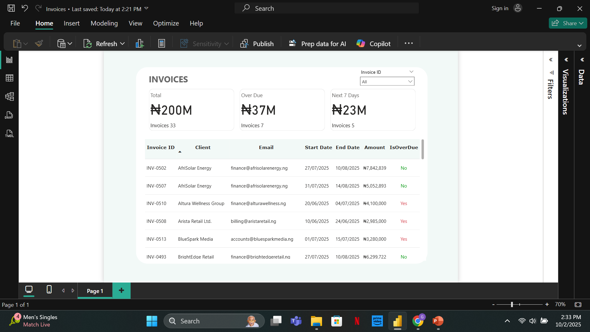

# Invoice Tracker – Airflow Workflow & Dashboard

## Objective
Build a workflow and dashboard to **automate invoice tracking**:
- Track invoices that are **overdue**  
- Highlight invoices that are **due within the next 7 days**  
- Provide a **dashboard** for visual insights into invoice status

## Project Overview
This project uses **Apache Airflow** to orchestrate workflows that:
1. **Extract invoice data** – client, start/end dates, email, amount, invoice ID (tested using a Jupyter Notebook)  
2. **Load the data** into a **PostgreSQL database**  
3. **Visualize** invoices in a **dashboard** for easy monitoring 


## How to Run Locally

1. Clone the repository:

```bash
git clone git@github.com:IamGeorge254/Invoice-Tracker.git
cd Invoice-Tracker
```

2. Start Airflow using Docker Compose:

```bash
docker-compose up -d
```

## Impact / Goal
This workflow and dashboard **save time and reduce errors** by automating invoice tracking.  
Businesses can quickly identify overdue invoices, upcoming payments, and visualize trends, improving financial management.

## Technicals Used:
- **Jupyter Notebook** – testing PDF invoice data extraction ([Pdf_Extraction.ipynb](Invoice-Tracker/Pdf_Extraction.ipynb)
- **Apache Airflow** – workflow orchestration ([Invoices_extraction.py](Invoice-Tracker/dags/Invoices_extraction.py)) 
- **Power BI Workbook** – [Download Invoices.pbix](Invoice-Tracker/Invoices.pbix) 
